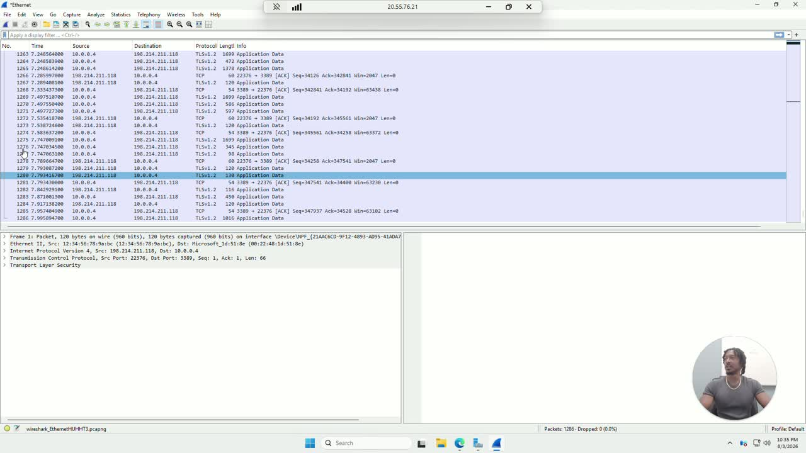
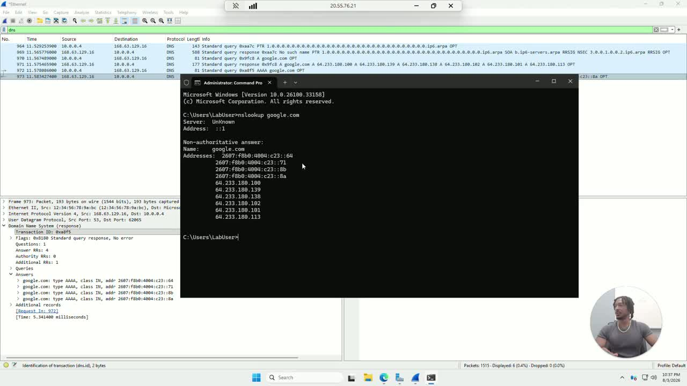
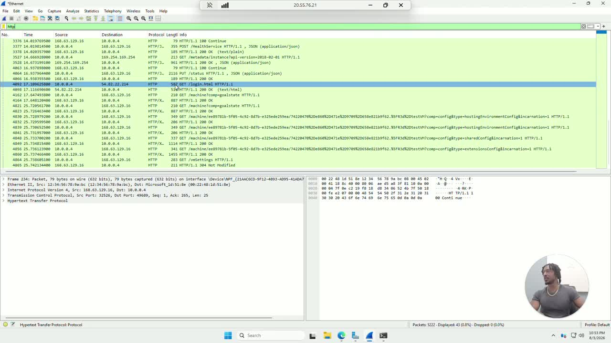

# Lab Notes — Wireshark Network Analysis

Full reference for the steps, filters, and findings behind this lab. Video walkthrough: [Loom](https://loom.com/share/2e0c11b46c1342c3b6858fd33ec923da)

## Core concepts

**Packet**: a small chunk of data that travels across the network. When you send a text or load a webpage, that data gets broken up into many packets, each with its own header (source IP, destination IP, port numbers, protocol flags, meaning the addressing and control info) and a fragment of the payload (the actual data being sent).

**Protocol**: a set of rules for formatting and transmitting data. Different protocols handle different jobs:
- **DNS** (Domain Name System): translates human-readable domain names into IP addresses, so a computer knows where to actually send traffic. Happens before almost every network connection.
- **HTTP** (Hypertext Transfer Protocol): carries webpage content in cleartext, meaning the text, images, and requests between a browser and a server.
- **HTTPS**: HTTP with TLS encryption added on top, so the same traffic can't be read even if it's captured.
- **TCP** (Transmission Control Protocol): manages the actual connection between two machines, ensuring data arrives reliably and in order.
- **ICMP**: used for ping and network diagnostics.

**TCP three-way handshake**: before two machines exchange data over TCP, they complete a three-step setup:
1. **SYN**: the client says "I want to connect."
2. **SYN, ACK**: the server says "I got your request, here's my acknowledgment."
3. **ACK**: the client says "Connection accepted, I'm ready to send data."

If a SYN has no SYN-ACK response, the connection was refused or the host is unreachable.

## Step 1: Install Wireshark

Downloaded from [wireshark.org](https://www.wireshark.org/download.html), Windows x64 Installer. Free, no account, no expiration.

## Step 2: Confirm it works with a test capture

Opened Wireshark, selected the active interface (Ethernet), and let it capture for a few seconds before stopping. Confirmed packets were captured, meaning Wireshark and the interface driver are working correctly.

## Step 3: Capture a DNS lookup with nslookup

- Started a new capture on the active interface.
- Opened Command Prompt and ran `nslookup google.com`, which forces the machine to send a DNS query for `google.com` and wait for the response, on command, instead of waiting for one to happen naturally.
- Stopped the capture back in Wireshark.

## Step 4: Analyze the DNS traffic

- Filtered for `dns`.
- Found the standard query and the standard query response for `google.com`.
- Expanded **Domain Name System (response) → Answers** to see the resolved A records, which matched exactly what `nslookup` returned in the terminal.

**Why it matters:** unexpected DNS queries to unusual domains are often the first sign of malware calling home. Recognizing what normal DNS traffic looks like is step one to spotting abnormal traffic.

## Step 5: Capture a TCP handshake

- Started a new capture.
- Browsed to `zero.webappsecurity.com/login.html` (a deliberately insecure HTTP test site used for these labs).
- Stopped the capture, ran `nslookup zero.webappsecurity.com` to get its IP (`54.82.22.214`).
- Filtered by `tcp and ip.addr == 54.82.22.214`.
- Reviewed the three-way handshake: **SYN → SYN, ACK → ACK**, followed by the HTTP GET for `/login.html`.

**Why it matters:** a SYN with no SYN-ACK tells you a connection was refused or the host is unreachable, which is one of the fastest ways to tell whether a "can't connect" issue is client-side, network-side, or server-side.

## Step 6: Spot cleartext credentials

- Started a new capture.
- On `zero.webappsecurity.com`, submitted fake login credentials and clicked Sign In.
- Stopped the capture and filtered for `http.request.method == POST`.
- Selected the "Sign in" POST entry and opened **HTML Form URL Encoded** in the packet detail pane, where the submitted username and password were visible in plain text.

**Why it matters:** this is exactly why every login form needs HTTPS. Without TLS encryption, anyone on the network path, whether that's an ISP, a coffee shop router, or an attacker performing a man-in-the-middle, can read submitted credentials exactly as typed.

## Step 7: Follow a full TCP stream

- Cleared the filter, started a new capture, opened a new browser window to `zero.webappsecurity.com`.
- Stopped the capture, filtered for `http`.
- Right-clicked an HTTP entry → **Follow → TCP Stream** (`Ctrl+Alt+Shift+T`).
- Wireshark reassembled the packets into a readable conversation: red text for the browser's request, blue text for the server's response.

**Why it matters:** individual packets are fragments. Stream reconstruction is how incident responders rebuild the full conversation during an investigation, showing what was requested and what data actually came back.

## Step 8: Save and export captures

- Filtered for `http`.
- **File → Export Specified Packets → Displayed** to save just the filtered results for documentation and reporting.

## Filters used in this lab

| Filter | Purpose |
| --- | --- |
| `dns` | Isolate DNS queries and responses |
| `tcp and ip.addr == <ip>` | Isolate all TCP traffic to/from a specific host |
| `http` | Isolate unencrypted HTTP traffic |
| `http.request.method == POST` | Isolate HTTP POST requests (e.g., form submissions) |

## Lesson learned

Domain concepts like DNS resolution and the TCP handshake are easy to describe but click differently once you've watched them happen packet by packet. Watching a real password cross the wire in plain text makes the case for HTTPS in a way no policy document does.

## What's next

- Capture traffic between two separate hosts instead of only the local machine, using port mirroring or a second VM
- Practice with `tshark` (the command-line version of Wireshark) for scripted or remote captures
- Build a noisier capture environment to practice filtering under conditions closer to production traffic