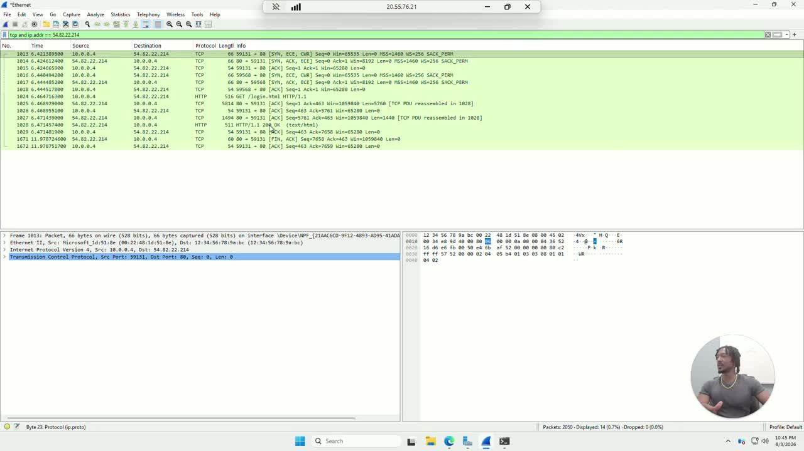
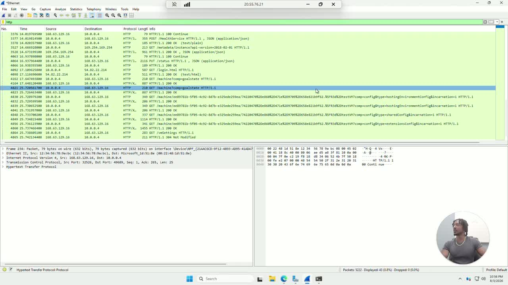
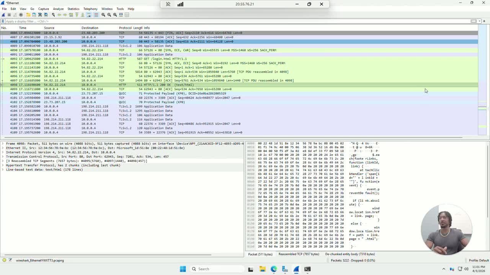

# Wireshark Network Analysis Lab

Hands-on packet capture and analysis using Wireshark! This tool is free and open source, no account required. I captures live traffic on a Windows VM to demonstrate DNS resolution, TCP connection setup, cleartext HTTP credential exposure, and full TCP stream reconstruction.

### Full walkthrough: [Loom video](https://loom.com/share/2e0c11b46c1342c3b6858fd33ec923da)

## Why this lab

When something breaks on a network, whether it's a service that's unreachable, a login that looks suspicious, or an app that's running slow, the packets are the ground truth. This lab builds the skills to actually read them: capturing live traffic, filtering it down to what matters, and learning what normal traffic looks like well enough to recognize when something isn't.

## Environment

| Component | Detail |
| --- | --- |
| Capture host | Windows VM, Ethernet interface |
| Tool | Wireshark (free, open source) |
| DNS target | `google.com` |
| Test site | `zero.webappsecurity.com` — intentionally insecure (HTTP) login page used for the credentials and stream exercises |

## Repo structure

```
wireshark-lab-repo/
├── captures/
│   └── README.md                  # placeholder — add your .pcapng files here
├── docs/
│   ├── lab-notes.md                # full step-by-step notes and filters used
│   └── screenshots/
│       ├── 01-ethernet-capture-overview.jpg
│       ├── 02-dns-lookup-nslookup.jpg
│       ├── 03-tcp-three-way-handshake.jpg
│       ├── 04-http-login-request.jpg
│       ├── 05-http-traffic-list.jpg
│       └── 06-tcp-stream-reassembly.jpg
└── README.md
```

## What this lab covers

1. Capturing live traffic on an active interface and confirming Wireshark is working
2. Triggering and identifying a DNS query/response pair with `nslookup`
3. Capturing and reading a full TCP three-way handshake (SYN → SYN-ACK → ACK)
4. Demonstrating cleartext credential exposure over HTTP
5. Following a full TCP stream to reconstruct a client/server conversation
6. Filtering and exporting captured traffic for documentation

Full step-by-step notes, filters used, and what each finding means: [docs/lab-notes.md](docs/lab-notes.md).

## Key findings

### DNS lookup
Ran `nslookup google.com` in a terminal while capturing, then filtered on `dns` in Wireshark. The standard query response's resolved A records matched exactly what `nslookup` returned at the command line, confirming the query and response Wireshark captured were part of the same transaction.


### TCP three-way handshake
Filtered `tcp and ip.addr == 54.82.22.214` after browsing to a test login page. The full SYN, SYN-ACK, ACK sequence is visible before any HTTP data moves. This is the pattern to check first when diagnosing "can't connect" issues.



### Cleartext credentials over HTTP
Submitted test login credentials to `zero.webappsecurity.com/login.html`, which runs HTTP instead of HTTPS by design. Filtering for `http.request.method == POST` and opening the form-encoded data shows the submitted username and password in plain text.




### Follow TCP Stream
Reassembled the full request and response exchange for the login page into one readable conversation, with red text for the request and blue text for the response, instead of reading it as scattered individual packets.



## Biggest lesson learned

Seeing a password cross the wire in plain text is a different kind of understanding than reading about why HTTPS matters. Once you've watched `HTML Form URL Encoded` data hand over a real username and password with zero effort, "always use HTTPS" stops being a policy line and becomes something you'd actually enforce.

## What's next

- Capture traffic between two separate hosts instead of only the local machine (port mirroring or a second VM)
- Practice with `tshark`, the command-line version of Wireshark, for scripted or remote captures
- Build a noisier capture environment to practice filtering under conditions closer to production traffic